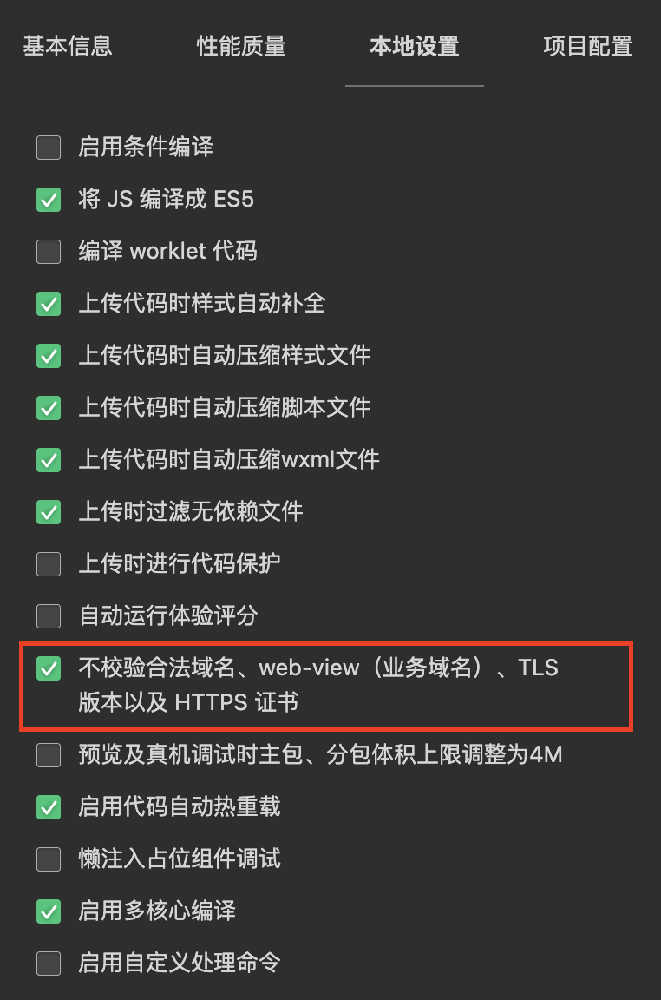

[](https://github.com/jinganix/guess/actions/workflows/ci.yml)
[](http://www.apache.org/licenses/LICENSE-2.0.html)

# Guess

The source code of the 'Guess Who I Am' Wechat miniprogram

## Run

### Backend

#### Linux or MacOS

```shell
git clone git@github.com:jinganix/guess.git
cd guess/service/guess
./gradlew service:guess:bootRun --args='--core.weapp.app-id=? --core.weapp.app-secret=? --core.url.db-mysql=? --spring.datasource.username=? --spring.datasource.password=?'
```

#### Windows

Replace `./gradlew` with `./gradlew.bat`

#### Description

- core.weapp.app-id: `app-id` of the Wechat miniprogram
- core.weapp.app-secret: `app-secret` of the Wechat miniprogram
- core.url.db-mysql： Mysql connection url，e.g. `jdbc:mysql://127.0.0.1:3306/guess`
- spring.datasource.username: Mysql connection username
- spring.datasource.password: Mysql connection password

### Frontend

#### Execute commands

```shell
git@github.com:jinganix/guess.git
cd guess/frontend/weapp
npm install
npm start
```

#### Wechat devtools

1. Import`guess/frontend/weapp/dist` into Wechat devtools
2. Disable domain verification

   

## Scan to experience


## Contributing

If you are interested in reporting/fixing issues and contributing directly to the code base, please see [CONTRIBUTING.md](CONTRIBUTING.md) for more information on what we're looking for and how to get started.
