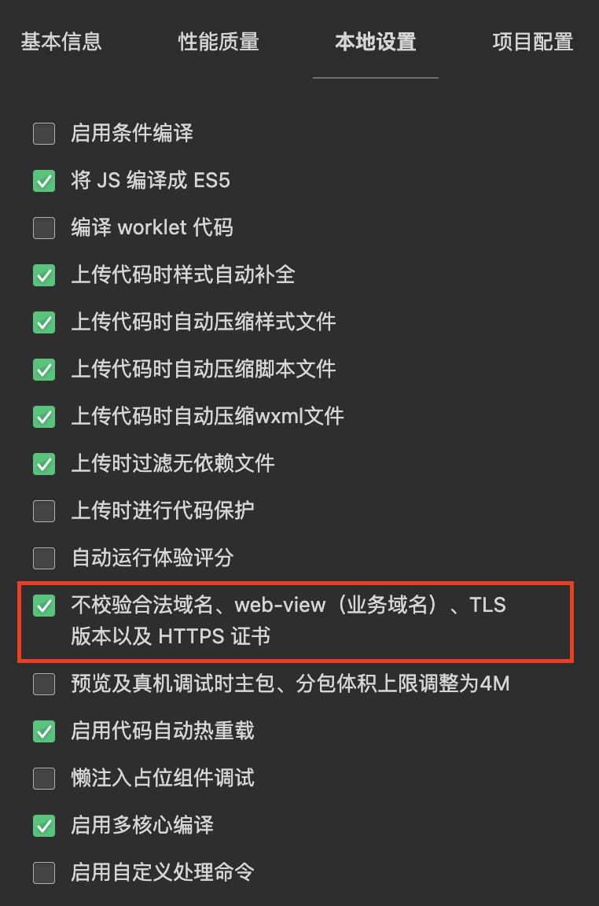
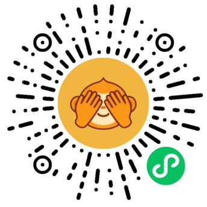

[](https://github.com/jinganix/guess/actions/workflows/ci.yml)
[](http://www.apache.org/licenses/LICENSE-2.0.html)

[English Version](README.en.md)

# 猜我是谁

本仓库是《猜我是谁》微信小程序的源码，你可以[扫码体验](#qr-code)此小程序

- 前端使用`Typescript`开发，用`webpack`构建打包
- 后端使用`Java`和`Spring`框架开发，用`gradle`构建打包

## 运行项目

你需要先拉取项目源码，切换到项目根目录，使用gradle构建项目

```shell
git clone git@github.com:jinganix/guess.git
cd guess
./gradlew build
```

### 后端

#### 通过docker-compose运行

修改[application-local.yml](service/guess/src/main/resources/application-local.yml)以运行项目后端服务

- core.weapp.app-id: 微信小程序的`app-id`
- core.weapp.app-secret: 微信小程序的`app-secret`

如果你已经安装`docker`和`docker-compose`，可以通过以下命令启动后端服务

```shell
docker-compose up
```

#### 通过gradle运行

你需要安装jdk，对应的版本在[.tool-versions](.tool-versions)，并启动mysql数据库

修改[application-local.yml](service/guess/src/main/resources/application-local.yml)以运行项目后端服务

- core.weapp.app-id: 微信小程序的`app-id`
- core.weapp.app-secret: 微信小程序的`app-secret`
- core.url.db-mysql: mysql数据库连接地址，如`jdbc:mysql://127.0.0.1:3306/guess`
- spring.datasource.username: 数据库用户名
- spring.datasource.password: 数据库密码

以下命令可以在`Linux`或`MacOS`系统中启动后端服务

```shell
./gradlew service:guess:bootRun
```

以下命令可以在`Windows`系统中启动后端服务

```shell
./gradlew.bat service:guess:bootRun
```

### 前端

你需要安装[node.js](https://nodejs.org/en)，对应的版本在[.tool-versions](.tool-versions)

#### 运行命令

```shell
git clone git@github.com:jinganix/guess.git
cd guess/frontend/weapp
npm install
npm start
```

#### 开发者工具设置

1. 开发者工具导入项目的dist目录：`guess/frontend/weapp/dist`
2. 关闭域名校验

   

## <a id="qr-code"></a>扫码体验



## 贡献

如果你有兴趣报告/修复问题并直接为代码库做出贡献，请查看 [CONTRIBUTING.md](CONTRIBUTING.md) 获取更多信息，了解我们期望的贡献内容以及如何开始
